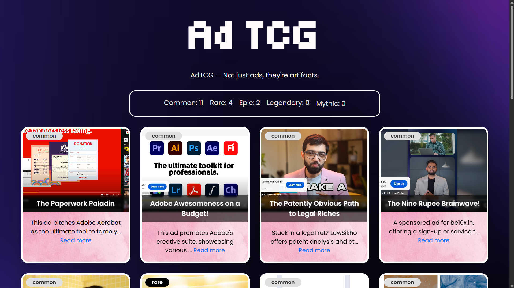
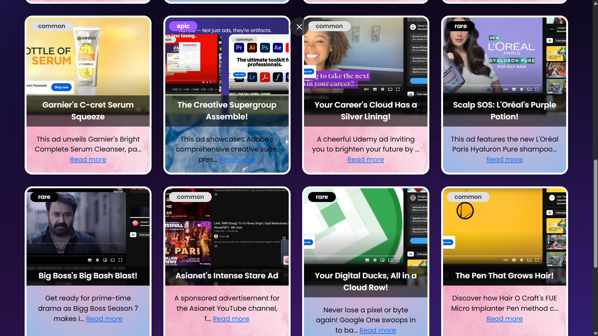
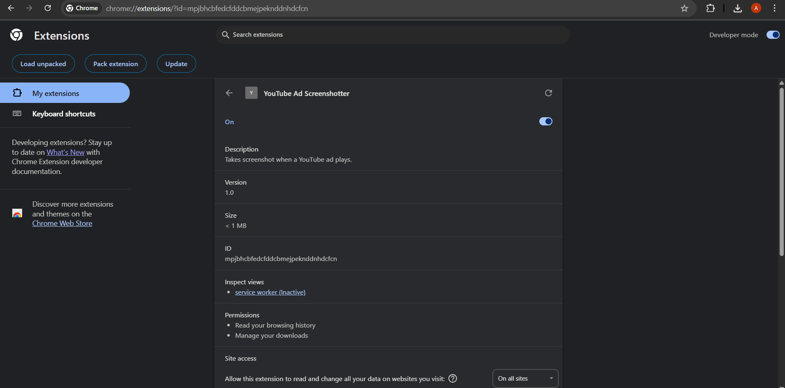

# AdTCG 🎯


## Basic Details
### Team Name: Ashlena & Athil


### Team Members
- Member 1: Athil johnson - Albertian Institute of Science & Technology
- Member 2: Ashlena Rose - Albertian Institute of Science & Technology

### Project Description
AdTCG is a totally unnecessary trading card game where YouTube ads become collectible cards. A Chrome extension captures ad screenshots, and our Node.js server turns them into cards with AI-generated titles, rarities, and lore. Gotta mute catch ’em all!

### The Problem (that doesn't exist)
Millions of YouTube ads go unappreciated every day. They interrupt our videos, they slow down our dopamine hits—and worst of all—they vanish into the void without ever becoming trading cards. Tragic.

### The Solution (that nobody asked for)
We built a Chrome extension that snapshots YouTube ads in real time, sends them to a server, lets AI hallucinate a card title and backstory, and proudly showcases them in a Bootstrap-powered gallery. Now, every annoying ad has a shot at becoming Legendary.

## Technical Details
### Technologies/Components Used
For Software:
- **Languages used**
  - JavaScript (because what else powers chaos?)
  - HTML & CSS (for the shiny card display)

- **Frameworks used**
  - Node.js (the brain of the backend)
  - Express.js (because writing raw Node HTTP routes is suffering)
  - EJS (to inject life into static HTML like a wizard)
  - Bootstrap (to pretend we know design)

- **APIs used**
  - [@google/genai](https://www.npmjs.com/package/@google/genai) – to let Gemini hallucinate ad descriptions  

- **Tools used**
  - Chrome Extension (Adstore) – spies on YouTube for you  
  - MongoDB – stores your card collection like a digital binder  
  - Git & GitHub – to version control all this nonsense  
  - Postman – to test your POSTs like a post office employee

For Hardware:

> _Spoiler: You probably have everything already_

- **Main components**
  - Any computer that can run Chrome and Node.js
  - A screen to display the ads you hate

- **Specifications**
  - A decent internet connection (for ads and AI wizardry)
  - Google Chrome browser (for extension support)

- **Tools required**
  - Your patience with YouTube ads  
  - A burning desire to turn annoyance into amusement

### Implementation
This project consists of two main components:

1. **Ad-server** – A Node.js/Express backend that receives and stores YouTube ad screenshots, assigns rarity and metadata, and serves them through a web interface.

2. **Adstore (Chrome Extension)** – A frontend utility that detects YouTube ads, captures a screenshot, and sends it to the server.


### Installation

1. **Clone the repository and install dependencies:**
```bash
git clone https://github.com/athil/AdTCG.git
cd AdTCG/Ad-server
npm install
````

2. **Set up your `.env` file** in the root of `Ad-server`:

```env
GOOGLE_API_KEY=your_google_gemini_key_here
```

---

### Chrome Extension Setup (Adstore)

1. Open Chrome and navigate to `chrome://extensions/`
2. Enable **Developer Mode** (toggle in the top-right corner)
3. Click **"Load Unpacked"**
4. Select the folder: `AdTCG/Adstore`

Once installed, the extension will:

* Detect YouTube ads
* Capture a screenshot of the video frame
* Send the image to your local backend server

---

### Run

Start the backend server:

```bash
node app.js
```

The server will run at:
`http://localhost:3000`

✅ Make sure the server is running before using the extension.

```
```


### Project Documentation


# Screenshots 


*Page that show all your valuable ads collected*


*same here*


*Chrome extension captures ad screenshots and automaticaly sends to the node server*


### Project Demo
# Video
[Add your demo video link here]
*Explain what the video demonstrates*

# Additional Demos
[Add any extra demo materials/links]

## Team Contributions
- [Name 1]: [Specific contributions]
- [Name 2]: [Specific contributions]
- [Name 3]: [Specific contributions]

---
Made with ❤️ at TinkerHub Useless Projects 


